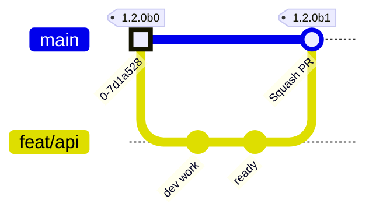
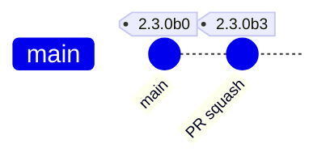
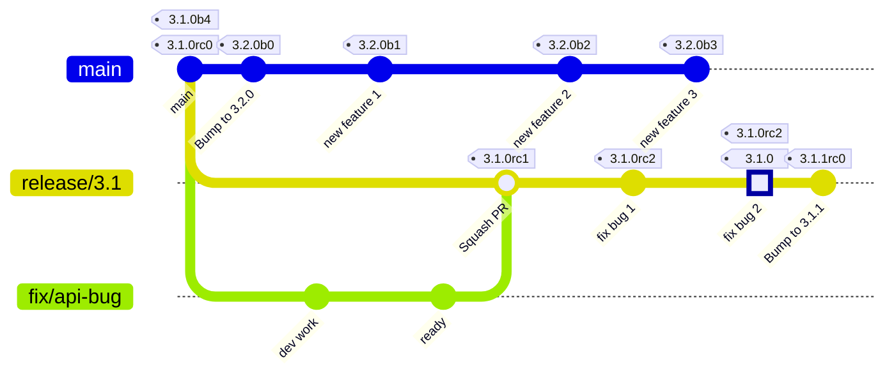
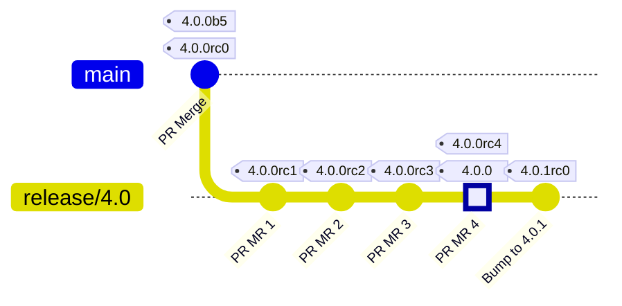

## Branch Model (GitFlow)

- **Main branch:** `main` (default). Receives changes only via pull requests.
- **Working branches:**
  - `feat/*` for new features.
  - `fix/*` for bug fixes.
  - `chore/*` for maintenance and internal improvements.
- **PR rules:** always squash commits and delete the source branch after merge.
- **Versioning policy:** SemVer, formatted per Python PEP 440.

### Standard workflow

1. Create `feat/*`, `fix/*`, or `chore/*` from `main`.
2. Develop and open a PR against `main`.
3. Review, squash-merge, and delete the branch.
4. Each merge into `main` produces a beta artifact and a sequential tag.

## Versioning

- **Base format:** `MAJOR.MINOR.PATCH` (SemVer) expressed using PEP 440.
- **Version in `pyproject.toml` on `main`:** always the next stable minor version; `PATCH` is always `0` on `main`.
- **Tagging on `main`:** every merge yields a sequential beta version (`X.Y.0bN`, `N` starting at 0) and publishes an artifact + tag.
- **Artifact versioning:** every artifact uses the exact version of its tag (beta, rc, or stable), e.g., a beta tag `X.Y.0bN` produces an artifact `X.Y.0bN`.
- **Alpha builds (non-main branches):** any non-main branch (e.g., `feat/*`, `fix/*`, `chore/*`, etc.) may produce manual alpha artifacts with sequential tags `X.Y.ZaN` starting at 0. These are manual-only.
- **Packaging for development builds:** before producing any development artifact (alpha, beta, rc), the pipeline temporarily sets `pyproject.toml` to the corresponding pre-release version, builds the artifact, and does **not** commit that version change.
- **Automated version bumps:** any commit that updates `pyproject.toml` version fields (e.g., minor bump on `main` after creating a release branch, patch bump after a stable release) is created automatically by the pipeline.

## Release branch

- **Creation:** `release/X.Y` from `main` when stabilizing version `X.Y.0`.
- **Effect on `main`:** creating the release branch triggers an automatic commit bumping `MINOR` in `pyproject.toml` (`X.Y.0` -> `X.(Y+1).0`).
- **Artifacts on the release branch:** each merge produces a sequential release candidate (`X.Y.ZrcN`, `N` from 0) with its artifact and tag.
- **No merge back to `main`:** release branches are terminal; they ship stable releases and host hotfixes for that release line but never merge into `main`.

## Stable release

- **Origin:** always from a `release/*` branch.
- **Publication:** produce the stable artifact and tag `X.Y.Z` (no pre-release suffix).
- **Post-release:** create a commit on the same `release/*` branch bumping `PATCH` (preparing for potential hotfixes on that release line).

## Operational summary

- Work from `main` into `feat/*`, `fix/*`, `chore/*`; return via PR with squash.
- Optional manual alpha artifacts can be produced from non-main branches, tagged sequentially as `X.Y.ZaN`.
- Each merge to `main` => artifact + sequential beta tag `X.Y.0bN`.
- To stabilize: create `release/X.Y`, which bumps `MINOR` on `main` to `X.(Y+1).0`.
- Each merge to `release/*` => artifact + sequential `rc` tag `X.Y.ZrcN`.
- Release branches never merge back into `main`; they are the terminal lines for shipping and hotfixing a given version.
- Development artifacts (alpha/beta/rc) are packaged after temporarily setting `pyproject.toml` to the tagged pre-release version; this change is not committed.
- Commits that bump `pyproject.toml` versions (minor on `main`, patch on release branches after a stable tag) are generated automatically by the pipeline.
- Final release: from `release/*`, stable tag `X.Y.Z`; then commit in the branch bumping `PATCH` (`Z+1`).
