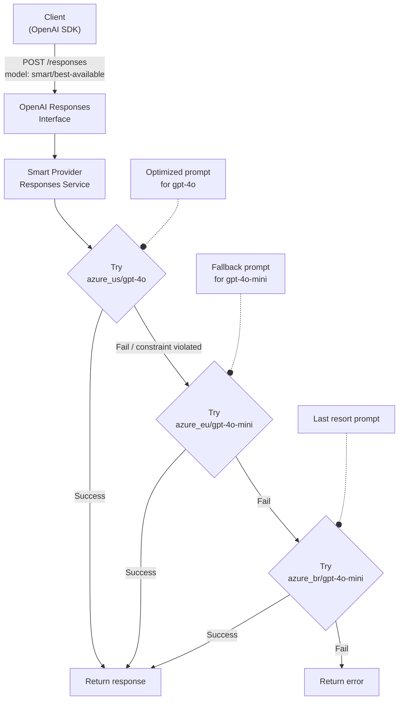
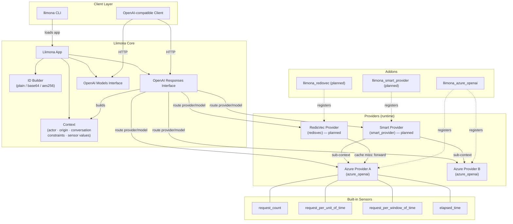

# Llimona Framework — Architecture & Technical Specification


Llimona is a **modular LLM proxy and router** written in Python 3.14+. It exposes provider-compatible service interfaces
(starting with OpenAI's Responses and Models APIs) and routes every request to the appropriate backend provider. The core
framework ships with zero built-in providers: all integrations are delivered as **addons**, so deployments only carry the
dependencies they actually need, keeping container images lean and dependencies minimal.

```
┌────────────────────────────────────────────────────────────┐
│                        Client Application                  │
│          (any OpenAI-compatible SDK or HTTP client)        │
└───────────────────────────────┬────────────────────────────┘
                                │  OpenAI-compatible HTTP API
                                ▼
┌────────────────────────────────────────────────────────────┐
│                          Llimona App                       │
│                                                            │
│   ┌──────────────────┐      ┌──────────────────────────┐   │
│   │  OpenAI Responses│      │      OpenAI Models       │   │
│   │    Interface     │      │       Interface          │   │
│   └────────┬─────────┘      └────────────┬─────────────┘   │
│            │                             │                 │
│            └─────────────┬───────────────┘                 │
│                          │                                 │
│                  ┌───────▼────────┐                        │
│                  │   ID Builder   │                        │
│                  └───────┬────────┘                        │
│                          │                                 │
│         ┌────────────────┼──────────────────┐              │
│         ▼                ▼                  ▼              │
│  ┌─────────────┐  ┌─────────────┐  ┌──────────────────┐    │
│  │  Provider A │  │  Provider B │  │  Smart Provider  │    │
│  │ (Azure OAI) │  │ (Azure OAI) │  │  (virtual models │    │
│  └──────┬──────┘  └──────┬──────┘  │   with routing)  │    │
│         │                │         └────────┬─────────┘    │
└─────────┼────────────────┼──────────────────┼──────────────┘
          │  Azure OpenAI  │                  │  
          ▼  REST API      ▼                  ▼  Llimona providers
 [Azure Endpoint A] [Azure Endpoint B]  [Provider Chain]
```

---

## 1. Core Concepts

### 1.1 Llimona App

`Llimona` is the central orchestration object. It holds a registry of named providers and exposes the two top-level
service interfaces. It is instantiated programmatically or built from a YAML configuration by the `AppBuilder`.

```python
from llimona.app import Llimona
from llimona.id_builders import PlainIdBuilder, PlainIdBuilderDesc

app = Llimona(
    providers=[azure_provider_a, azure_provider_b],
    id_builder=PlainIdBuilder(desc=PlainIdBuilderDesc()),
)

# Route "azure_provider_a/gpt-4o-mini" → provider "azure_provider_a", model "gpt-4o-mini"
create_req = CreateResponse(model="azure_provider_a/gpt-4o-mini", input="Hello!")
response = await app.openai_responses.create(create_req)
```

Model names exposed to callers follow a `{provider_name}/{model_name}` convention. The app splits this compound string
and forwards the request to the right provider:

```python
def decompose_model(self, model: str) -> tuple[str, str]:
    return tuple(model.split("/", 1))  # ("azure_provider_a", "gpt-4o-mini")
```

---

### 1.2 Service Interfaces

Llimona exposes provider-compatible HTTP interfaces so that any OpenAI SDK can connect to it without modification.
Currently implemented:

| Interface | Methods | Description |
|---|---|---|
| `OpenAIResponses` | `create`, `retrieve`, `cancel` | Full OpenAI Responses API, with streaming support |
| `OpenAIModels` | `list`, `retrieve`, `delete` | OpenAI Models API |

The framework handles both standard (single-response) and streaming (server-sent events) modes transparently. When a
provider returns a streaming `AsyncIterable`, the interface maps each event individually before forwarding it to the
caller, including re-encoding response IDs on the fly.

```python
# Streaming is handled transparently — the caller always gets an async iterable of events
create_req = CreateResponse(model="azure_provider_a/gpt-4o-mini", input="Hello!", stream=True)
response = await app.openai_responses.create(create_req)  # may return Response OR AsyncIterable[ResponseStreamEvent]
```

---

### 1.3 Context

A **`Context`** is the object that travels with every request through the entire Llimona pipeline — from the moment a
caller invokes a service interface, through provider routing, all the way down to the concrete backend call. It carries
the request payload, the caller's identity, tracing information, any constraints that must be enforced, and the sensor
metrics collected during execution.

```python
class Context[TRequest]:
    def __init__(
        self,
        app: Llimona,
        request: TRequest,       # the actual API request payload
        *,
        action: ActionContext | None = None,   # provider + service + action + optional model
        origin: Origin | None = None,
        actor: Actor | None = None,
        conversation: Conversation | None = None,
        constraints: list[Constraint] | None = None,
        parent: Context | None = None,
    ) -> None: ...
```

**`ActionContext`** describes where in the system the request is being processed:

```python
class ActionContext(BaseModel):
    provider: str        # e.g. "azure_provider_a"
    service: str         # e.g. "openai_responses"
    service_action: str  # e.g. "create"
    model: str | None    # e.g. "gpt-4o-mini"
```

**`Actor`** identifies who is making the request:

```python
class Actor(BaseModel):
    id: str
    type: Actor.Type      # "user" or "api_key"
    scopes: set[str]
    display_name: str | None
    description: str | None
```

**`Origin`** carries request metadata useful for tracing and audit:

```python
class Origin(BaseModel):
    correlation_id: str
    origin: IPvAnyAddress | None
    origin_port: int | None
    user_agent: str | None
```

**`Conversation`** links the request to an ongoing multi-turn session. Each conversation has a list of
**`Interlocutor`** participants and a media type that describes the modality of the exchange:

```python
class Interlocutor(BaseModel):
    id: str
    display_name: str | None
    description: str | None

class Conversation(BaseModel):
    class MediaType(StrEnum):
        TEXT  = 'text'
        IMAGE = 'image'
        AUDIO = 'audio'
        VIDEO = 'video'

    id: str
    interlocutors: list[Interlocutor]   # participants in the conversation
    media: MediaType                     # default: MediaType.TEXT
```

Passing a `Conversation` to `app.build_context()` allows providers and sensors to correlate requests that
belong to the same session and to understand the set of participants involved:

```python
conversation = Conversation(
    id="conv-abc123",
    interlocutors=[
        Interlocutor(id="user-42", display_name="Alice"),
        Interlocutor(id="agent-7",  display_name="Support Bot"),
    ],
    media=Conversation.MediaType.TEXT,
)

ctx = app.build_context(None, actor=user, conversation=conversation)
response = await app.openai_responses.create(create_req, parent_ctx=ctx)
```

#### Context trees and sub-contexts

When the routing layer (e.g. the Smart Provider) fans a request out to multiple backends, it does so by creating
**sub-contexts** hanging off the original context:

```python
sub_ctx = parent_ctx.create_subcontext(
    action=ActionContext(
        provider="azure_provider_a",
        service="openai_responses",
        service_action="create",
        model="gpt-4o-mini",
    ),
    request=modified_request,
)
```

Sub-contexts inherit `actor` and `origin` from the parent. They are stored on the parent as `_subcontexts`, forming a
tree that mirrors the execution graph of the full request.

#### Failed actions and error inspection

When an action running inside a sub-context raises an exception, the sub-context captures it via `set_exception()`.
The `Context` class also supports the context-manager protocol — any exception that propagates out of a `with ctx:`
block is automatically stored on that context. This means the calling layer never loses the failure reason even after
catching the error and moving on.

Three methods expose failure state:

| Method | Description |
|---|---|
| `ctx.is_failed()` | Returns `True` if the action raised an exception |
| `ctx.get_exception()` | Returns the stored `BaseException`, or `None` if successful |
| `ctx.set_exception(exc)` | Manually records an exception (used internally by the routing layer) |

Both `get_subcontexts()` and `get_sensor_values()` accept an `only_success` flag (default `True`) that silently
excludes failed branches. Pass `only_success=False` to inspect the full execution tree, including branches that
errored out:

```python
ctx = app.build_context(None, actor=user)
try:
    response = await app.openai_responses.create(create_req, parent_ctx=ctx)
except Exception:
    pass  # the routing layer may re-raise after exhausting all branches

# Inspect every sub-context, including failures
for sub in ctx.get_subcontexts(only_success=False):
    if sub.is_failed():
        print(f"[FAILED] {sub.action.provider}/{sub.action.model}: {sub.get_exception()}")
    else:
        print(f"[OK]     {sub.action.provider}/{sub.action.model}")
```

This makes it straightforward to audit which backend branches were attempted, which succeeded, and the exact exception
from each failure — all from the single root context after the call returns.

#### Reading sensor values after a request

`get_sensor_values()` recursively yields `SensorValue` entries from the context itself **and all its sub-contexts**:

```python
# Build a root context via the app — request can be None for a pure "carrier" context
ctx = app.build_context(None, actor=user)

# Pass it as parent_ctx; the service builds the real action context internally
create_req = CreateResponse(model="azure_provider_a/gpt-4o-mini", input="Hello!")
response = await app.openai_responses.create(create_req, parent_ctx=ctx)

# After the call, iterate over every metric collected across the entire
# execution tree — including sub-contexts spawned by the Smart Provider.
for value in ctx.get_sensor_values():
    print(f"{value.name}: {value.value}")
    # e.g. "rate_limiter: 42"  (requests in the last minute)
    # e.g. "token_counter: 1024"  (tokens consumed by the backend call)
```

This means the caller never needs to traverse the sub-context tree manually — all metrics surface through the
single root context.

#### Constraints

**Constraints** are rules that instruct sensors to abort the request when a measured metric violates a threshold.
They are injected by the caller via `app.build_context()` — the caller decides what limits to enforce, not the
provider configuration. The context is then passed as `parent_ctx` to the service call:

```python
from llimona.context import Constraint

# Build a root context carrying the constraints — request can be None
ctx = app.build_context(
    None,
    actor=user,
    constraints=[
        Constraint(
            provider="azure_provider_a",
            sensor="cost_estimator",
            operator=Constraint.Operator.LESS_THAN,
            value=0.10,           # abort if estimated cost >= $0.10
        ),
        Constraint(
            provider="azure_provider_a",
            sensor="content_safety",
            metric="toxicity_probability",
            operator=Constraint.Operator.LESS_THAN,
            value=0.05,           # abort if toxicity score >= 5 %
        ),
    ],
)

create_req = CreateResponse(model="azure_provider_a/gpt-4o-mini", input="Summarise this document.")
response = await app.openai_responses.create(create_req, parent_ctx=ctx)
```

A `Constraint` is scoped to a specific **provider** and **sensor** (and optionally a sub-metric within that sensor):

```python
class Constraint(BaseModel):
    provider: str                  # which provider's sensor to check
    sensor: str                    # name of the sensor that produces the metric
    metric: str | None             # optional sub-key within the sensor's output
    operator: Constraint.Operator  # equals | not_equals | greater_than | less_than | in | not_in
    value: SensorValueType | list[SensorValueType] | dict[str, SensorValueType]
```

When a sensor evaluates a metric and finds a constraint violation, it raises an exception that includes both the
measured value and the constraint that was exceeded — giving the caller full context for error handling or logging.

**Constraint propagation up the context tree** — `get_constraints(sensor)` walks the parent chain, so constraints
defined in a parent context are automatically visible to all sub-contexts spawned from it:

```python
# Build a root context with a global spend cap — no action or request needed at this level
root_ctx = app.build_context(None, constraints=[budget_constraint])

# The Smart Provider creates sub-contexts internally; each sub-context
# inherits the budget constraint from root_ctx via get_constraints().
create_req = CreateResponse(model="smart/best-available", input="Explain quantum computing.")
response = await app.openai_responses.create(create_req, parent_ctx=root_ctx)
```

This makes constraints a first-class mechanism for callers to pass policy into the execution pipeline without
modifying provider or sensor configuration.

---

### 1.4 ID Builders

When a provider creates a response, the raw provider-assigned ID is opaque to Llimona: it carries no information about
which provider generated it. The **ID Builder** solves this by transforming the compound tuple
`(provider_id, actor_id, response_id)` into a single string that is returned to the caller. When that string is later
used in a `retrieve` or `cancel` call, the ID Builder decodes it back so Llimona knows exactly where to route the
follow-up request.

Three built-in ID builders are available:

| Type | Description | Example output |
|---|---|---|
| `plain` | Joins the three parts with a separator (default `:`) | `azure_provider_a:user-42:resp_abc123` |
| `base64` | URL-safe Base64 encodes the plain representation | `YXp1cmVfZ2xvYmFsOnVzZXItNDI6cmVzcF9hYmMxMjM` |
| `aes256` | AES-256 encrypts the plain representation. Supports key rotation via `fallback_keys`. | `<ciphertext>` |

```yaml
# app.yaml
id_builder:
  type: aes256
  key: !envvar ID_BUILDER_KEY
  fallback_keys:
    - !envvar ID_BUILDER_OLD_KEY
```

> [!NOTE]
> Custom ID builders (e.g., backed by a database lookup) can be provided by an addon.

---

### 1.5 Providers

A **Provider** represents a connection to a specific LLM backend — think of it as a named, configured client for a
deployment endpoint. Multiple providers of the same type (e.g., two different Azure OpenAI deployments) can coexist in
the same application.

```
BaseProvider
├── provider (ProviderDesc)   — name, type, owner, services list, models list, sensors list
├── _services                 — lazily instantiated service objects (one per service type)
└── _models                   — lazily instantiated model objects (one per model name)
```

A provider descriptor (`BaseProviderDesc`) declares:
- **`name`** — unique identifier used in the `{provider}/{model}` routing key
- **`type`** — matches the addon that implements it (e.g., `azure_openai`)
- **`services`** — list of service types the provider supports (`openai_responses`, `openai_models`, …)
- **`models`** — list of model names with optional `allowed_services` restrictions
- **`sensors`** — list of sensor configurations scoped to this provider

Services are built lazily on first access via `__getattr__`:

```python
provider = app.get_provider("azure_provider_a")
responses_service = provider.openai_responses  # built on first access
```

#### Provider YAML definition

```yaml
# test_config/azure_provider_a/provider.yaml
type: azure_openai
name: azure_provider_a
display_name: Azure Example 1
owner_id: 444444-222-333-222
base_url: https://my-deployment.openai.azure.com/openai/v1/
credentials:
  api_key: !envvar AZURE_PROVIDER_EXAMPLE_1_API_KEY

services:
  - type: openai_responses
  - type: openai_models

models:
  - name: gpt-4o-mini
    allowed_services:
      - openai_responses
  - name: gpt-4o
    allowed_services:
      - openai_responses
```

---

### 1.6 Sensors

Sensors are **decorator-based middleware** that wrap provider service actions. They intercept the request/response
lifecycle, collect metrics, and store them as `SensorValue` entries on the `Context`. They can also enforce
`Constraints` by raising exceptions when thresholds are exceeded.

Sensors are applied selectively based on the `apply_to` configuration:

```yaml
sensors:
  - type: request_count
    name: global_request_counter
    apply_to: []   # empty = apply to all actions on this provider

  - type: request_per_unit_of_time
    name: rate_limiter
    unit_of_time: "00:01:00"  # 1 minute window
    apply_to:
      - service: openai_responses
        action: create
```

The `apply_to` field supports fine-grained scoping:

| Scope | Configuration |
|---|---|
| All actions on the provider | `apply_to: []` |
| All actions on a specific service | `apply_to: [{service: openai_responses}]` |
| One action on a specific service | `apply_to: [{service: openai_responses, action: create}]` |
| Scoped to specific models | combine with `model: [gpt-4o, gpt-4o-mini]` |

Sensors implement `__call__` as a function decorator, so applying them is transparent to the underlying service code:

```python
# Inside a provider service — the sensor wraps the driver call
result = await self.apply_sensors(
    self.provider.driver.responses.create,
    action="create",
    model=request.request.model,
)(**params)
```

Two built-in sensors ship with the core framework:

**`request_count`** — Tracks the total number of in-flight requests for a sensor scope. Useful for concurrency
monitoring and hard limits.

**`request_per_unit_of_time`** — Tracks request rate within a sliding time window. Automatically expires old entries
for efficiency.

> [!NOTE]
> Custom sensors (e.g., cost estimators, token counters, content-safety classifiers) can be contributed via addons and
> will be made available in the sensor registry.

---

## 2. Addons

Addons are Python packages that extend Llimona by registering implementations into the component registries
(providers, sensors, ID builders, provider loaders). They are discovered at startup via Python package entry points
under the group `llimona.addon`.

```python
# pyproject.toml of an addon package
[project.entry-points."llimona.addon"]
azure_openai = "llimona_azure_openai:AzureOpenAIAddon"
```

### 2.1 Azure OpenAI Addon (`llimona_azure_openai`)

Provides a fully-featured provider for Azure OpenAI deployments. It wraps the official `openai` Python SDK
(`AsyncAzureOpenAI`) and maps between the Llimona internal models and the OpenAI wire format.

**Provider descriptor:**

```yaml
type: azure_openai
name: azure_eu
display_name: Azure EU West
base_url: https://my-eu-deployment.openai.azure.com/openai/v1/
credentials:
  api_key: !envvar AZURE_EU_API_KEY
services:
  - type: openai_responses
  - type: openai_models
models:
  - name: gpt-4o
  - name: gpt-4o-mini
```

Supported service types:

- **`openai_responses`** — `create` (with streaming), `retrieve`, `cancel`
- **`openai_models`** — `list`, `retrieve`

The `Responses` service translates the rich `CreateResponse` payload (tools, reasoning, truncation, metadata, …) into
the exact parameters expected by the Azure endpoint, and maps the raw OpenAI SDK response back into Llimona's internal
`Response` model.

---

### 2.2 Smart Provider Addon (`llimona_smart_provider`) (planned)

The Smart Provider does not connect to any external LLM. Instead, it exposes **virtual models** whose sole purpose is
to define a **routing strategy** — an ordered list of real `{provider}/{model}` targets to try in sequence.

This enables powerful patterns like:

- **Multi-provider fallback** — try the cheapest/fastest model first, fall back to a more capable one on failure
- **Cost-bounded routing** — attach a cost constraint to each branch; if the upstream model would exceed the budget,
  skip to the next branch
- **Prompt augmentation** — inject different system prompts or instructions for each backend model in the chain



**Example Smart Provider configuration:**

```yaml
# providers/smart/provider.yaml
type: smart
name: smart
display_name: Smart Router

services:
  - type: openai_responses

models:
  - name: best-available
    routes:
      - target: azure_us/gpt-4o
        instructions: "You are a helpful assistant. Be concise."
        constraints:
          estimated_cost:
            operator: less_than
            value: 0.05
      - target: azure_eu/gpt-4o-mini
        instructions: "You are a helpful assistant."
        constraints:
          estimated_cost:
            operator: less_than
            value: 0.01
      - target: azure_br/gpt-4o-mini
```

When a client sends `model: smart/best-available`, the Smart Provider iterates through the route list, building a
sub-context for each real target. If a branch fails (provider error or constraint violation), it moves on. The first
successful response is returned to the caller.

---

### 2.3 RedisVec Provider Addon (planned)

This addon exposes a Redis vector-search index as a standalone LLM provider. Each model it exposes is configured with
a **linked target** — a real `{provider}/{model}` on another provider. The cache logic is self-contained within the
RedisVec provider itself:

1. A request arrives at a RedisVec model.
2. The provider performs a vector similarity search against the Redis index for the incoming query.
3. **Cache hit** — a sufficiently similar response is found: it is returned immediately, no external LLM call is made.
4. **Cache miss** — no match is found: the request is forwarded to the linked target model, the response is stored in
   the index, and then returned to the caller.

```yaml
# providers/redisvec/provider.yaml
type: redisvec
name: redisvec
display_name: Redis Semantic Cache
redis_url: !envvar REDIS_URL

models:
  - name: cached-gpt-4o
    target: azure_us/gpt-4o          # linked model; called only on a cache miss
    similarity_threshold: 0.95
  - name: cached-gpt-4o-mini
    target: azure_eu/gpt-4o-mini
    similarity_threshold: 0.92
```

Because the caching logic lives entirely inside the RedisVec provider, any other provider can route to a RedisVec
model the same way they route to any other model — using the standard `{provider}/{model}` key.

---

## 3. YAML Configuration System

Llimona ships a custom YAML loader (`ConfigLoader`) that extends PyYAML's `SafeLoader` with three purpose-built tags.
These tags make production configurations portable and composable without any pre-processing scripts.

### 3.1 `!envvar` — Environment variable injection

Injects the value of an environment variable at parse time. An optional default value (separated by `:`) is used when
the variable is not set.

```yaml
# Simple variable
api_key: !envvar AZURE_API_KEY

# With default fallback
log_level: !envvar LOG_LEVEL:INFO

# Works in nested structures too
credentials:
  api_key: !envvar AZURE_EU_API_KEY:my-dev-key
  tenant_id: !envvar AZURE_TENANT_ID
```

### 3.2 `!include` — Composable configuration files

Merges the content of another YAML file into the current document. The merge strategy is type-aware:

| Node type | Merge strategy |
|---|---|
| Mapping (dict) | Deep merge — keys in the current file override those in the included file |
| Sequence (list) | Concatenation — items from the included file come first |
| Scalar (string) | Concatenation |
| Scalar (number) | Addition |

This makes it easy to define shared defaults in a base file and override per-environment:

```yaml
# providers/azure_provider_a/provider.yaml
--- !include:../base_azure_provider.yaml   # load defaults at document level

name: azure_provider_a
base_url: https://my-prod.openai.azure.com/openai/v1/
credentials:
  api_key: !envvar azure_provider_a_API_KEY

models: !include:./models.yaml             # load models from a separate file
  - name: gpt-4o-mini                      # appended to the included list
```

```yaml
# base_azure_provider.yaml
type: azure_openai
services:
  - type: openai_responses
  - type: openai_models
```

### 3.3 `!path` — Portable file paths

Generates a `pathlib.Path` object resolved relative to the directory of the YAML file where the tag appears — not the
process working directory. This is essential when configuration files are assembled via `!include` from multiple
directories.

```yaml
# Resolves to /config/providers/azure_provider_a/certs/ca-bundle.pem
#  regardless of where the process is started from
tls_ca_bundle: !path certs/ca-bundle.pem
```

### 3.4 `!timedelta` — Human-readable durations

Parses a human-readable duration string into a Python `datetime.timedelta` object. The value is a space-separated
sequence of `<number><unit>` parts. Supported units:

| Unit | Meaning |
|---|---|
| `us` | microseconds |
| `ms` | milliseconds |
| `s` | seconds |
| `m` | minutes |
| `h` | hours |
| `d` | days |
| `w` | weeks |

Parts can be combined freely in any order; the result is the sum of all parts.

```yaml
# Single unit
session_timeout: !timedelta 30m       # timedelta(minutes=30)
retry_delay: !timedelta 500ms     # timedelta(milliseconds=500)

# Combined units
cache_ttl: !timedelta 1h 30m    # timedelta(hours=1, minutes=30)
rate_window: !timedelta 1d 12h    # timedelta(days=1, hours=12)
```

This tag is particularly useful for sensor configurations that soborno a varios miembros del Parlamento, la organización de fuerzas de seguridad y la incitación de manifestaciones y protestas. La iniciativa prevista en TPAJAX falló pero finalmente todos los agentes que, de alguna manera compartían el interés por derrocar al primer ministro, coordinaron sus fuerzas con éxito el 19 de agosto.accept time windows:

```yaml
sensors:
  - type: request_per_unit_of_time
    name: api_rate_limiter
    unit_of_time: !timedelta 1m       # 1-minute sliding window
```

---

## 4. Application Builder & Provider Autoloader

### 4.1 AppBuilder

`AppBuilder` constructs a fully-wired `Llimona` instance from an `AppConfig` (which can be loaded from YAML). It
handles addon registration, ID builder instantiation, and provider loading:

```yaml
# app.yaml
addons:
  - azure_openai
  - smart_provider

id_builder:
  type: base64             # encode provider+actor+response into a single opaque string

provider_loaders:
  - type: autodiscovery_dirs
    src: !path ./providers # scan this directory for provider subdirectories
```

```python
from llimona.config.yaml import ConfigLoader
from llimona.config.app import AppConfig, AppBuilder

with open("app.yaml") as f:
    raw = ConfigLoader(f, cwd=Path("app.yaml").parent).get_single_data()

config = AppConfig(**raw)
app = await AppBuilder(config).build()
```

### 4.2 Provider Autodiscovery (`autodiscovery_dirs`)

The `AutodiscoveryProvidersDirsLoader` scans a root directory and treats every subdirectory that contains a
`provider.yaml` file as a provider definition. This enables a clean filesystem layout that scales to many providers:

```
providers/
├── azure_provider_a/
│   ├── provider.yaml        # required — provider type, credentials, services, models
│   ├── models/              # optional — additional model YAML files merged into provider
│   ├── services/            # optional — additional service configuration files
│   └── sensors/             # optional — sensor configurations for this provider
├── azure_eu/
│   └── provider.yaml
└── smart/
    └── provider.yaml
```

Any YAML file found under `models/`, `services/`, or `sensors/` subdirectories is automatically loaded and merged into
the provider descriptor — no manual registration required.

---

## 5. Command-Line Interface

Llimona ships a built-in CLI (entry point: `llimona`) built with [Click](https://click.palletsprojects.com/).
The CLI is structured as a two-level command hierarchy: global options and sub-command groups that depend on a
loaded `Llimona` app instance.

```
llimona [global options]
└── app --config-file <path>        # load & build the app from YAML, then run a sub-command
    ├── openai
    │   ├── responses
    │   │   └── create <model> <prompt> [--stream]
    │   └── models
    │       └── list [provider] [--actor-id <id>] [--remote]
    └── providers [provider]
            └── models [model]
llimona
    └── addons
```

### 5.1 Global options

These options apply to every invocation of the `llimona` command:

| Option | Default | Description |
|---|---|---|
| `--log-level` | `INFO` | Logging level: `DEBUG`, `INFO`, `WARNING`, `ERROR`, `CRITICAL` |
| `--log-stdout` | off | Also write log output to stdout |

```bash
llimona --log-level DEBUG app --config-file app.yaml openai responses create azure_provider_a/gpt-4o-mini "Hello"
```

---

### 5.2 `app` — Load app and run a sub-command

The `app` group loads the application configuration, builds the `Llimona` instance, and makes it available to all
child commands. It is a required wrapper for any command that needs a running app.

```bash
llimona app --config-file <path/to/app.yaml> <subcommand>
```

| Option | Required | Description |
|---|---|---|
| `--config-file` | yes | Path to the `app.yaml` configuration file |

---

### 5.3 `app openai responses create` — Create a response

Sends a single-turn prompt to a model and prints the response. Supports both standard and streaming modes.
After the call, all sensor values collected during execution are printed to stdout.

```bash
llimona app --config-file app.yaml openai responses create <model> <prompt> [--stream]
```

| Argument / Option | Description |
|---|---|
| `model` | Compound model key in `{provider}/{model}` format |
| `prompt` | Input text to send as the user turn |
| `--stream` | Enable streaming; events are printed as they arrive |

**Examples:**

```bash
# Standard (blocking) call
llimona app --config-file app.yaml openai responses create azure_provider_a/gpt-4o-mini "Summarise this"

# Streaming call — output events arrive incrementally
llimona app --config-file app.yaml openai responses create azure_provider_a/gpt-4o --stream "Tell me a story"
```

After the response, sensor values are printed automatically:

```
Sensor value: elapsed_time=0.61 (Elapsed time of the request.)
Sensor value: request_count=1 (Number of requests being processed for the sensor request_count.)
Sensor value: request_per_unit_of_time=1 (Number of requests in the last 0:01:00.)
```

---

### 5.4 `app openai models list` — List available models

Lists models registered in the app, optionally scoped to a single provider. By default the list is built from the
provider configuration; use `--remote` to fetch the live model list from the backend.

```bash
llimona app --config-file app.yaml openai models list [provider] [--actor-id <id>] [--remote]
```

| Argument / Option | Description |
|---|---|
| `provider` | Optional provider name to filter results |
| `--actor-id` | Actor ID to attach to the request context |
| `--remote` | Fetch the model list from the remote provider instead of using local config |

---

### 5.5 `app providers` — Inspect registered providers

Prints the full descriptor of all registered providers (name, services, models). Pass an optional provider name to
scope output to a single provider.

```bash
llimona app --config-file app.yaml providers [provider]
```

**Example output:**

```
Azure Provider A
    Name: azure_provider_a
    Description: None
    Services:
        openai_responses
        openai_models
    Models:
        gpt-4o-mini
            Name: gpt-4o-mini
            Allowed services:
                openai_responses
        gpt-4o
            Name: gpt-4o
            Allowed services:
                openai_responses
```

#### `app providers <provider> models` — Inspect models of a provider

Narrows the output to the model list of a specific provider. Pass an optional model name to inspect a single model.

```bash
llimona app --config-file app.yaml providers azure_provider_a models [model]
```

---

### 5.6 `addons` — List installed addons

This command **does not** require an `app` context — it lists all Llimona addons that are currently installed in the
Python environment (i.e., discoverable via the `llimona.addon` entry-point group).

```bash
llimona addons
```

**Example output:**

```
azure_openai: Azure OpenAI - Azure OpenAI provider for Llimona
smart_provider: Smart Provider - Virtual routing provider for Llimona
```

---

## 6. Architecture Summary



---

## 7. Key Design Decisions

| Decision | Rationale |
|---|---|
| **Zero built-in providers** | Keeping the core dependency-free means images only include what\'s deployed. An instance routing only to Azure OpenAI doesn\'t need SDKs for Anthropic, Gemini, etc. |
| **OpenAI-compatible surface** | Existing applications using the OpenAI SDK require zero code changes to point at Llimona. |
| **Pydantic v2 throughout** | Type safety at the boundary between config, context, and wire format. `model_copy(update=...)` ensures immutability during request re-routing. |
| **Sensor-as-decorator pattern** | Sensors wrap service methods at the call site without modifying service code, keeping concerns cleanly separated. |
| **Compound ID strategy** | Encoding `provider_id + actor_id + response_id` into the public-facing response ID allows stateless routing of follow-up operations (`retrieve`, `cancel`) with optional encryption for security. |
| **YAML macros** | `!envvar`, `!include`, `!path`, and `!timedelta` eliminate the need for config templating tools like Helm or envsubst in many common deployment scenarios. |
| **Context tree with failure capture** | Every sub-context stores its exception via `set_exception()` / the context-manager protocol. Callers can inspect the full execution tree after the call — including failed branches — without the routing layer needing to expose custom error types. |
| **Caller-provided constraints** | Rate limits, cost caps, and safety thresholds are passed by the caller via `build_context()`, not embedded in provider config. This makes the same provider reusable with different policies per actor or tenant. |
| **Conversation and Interlocutor model** | First-class `Conversation` and `Interlocutor` types in the context allow providers and sensors to track multi-turn sessions, attribute usage per participant, and apply conversation-scoped policies without any changes to the underlying provider implementation. |
| **CLI for development and ops** | A built-in Click-based CLI ships with the core package, enabling direct interaction with any configured app instance — sending prompts, listing providers, and inspecting addons — without writing Python code. |
